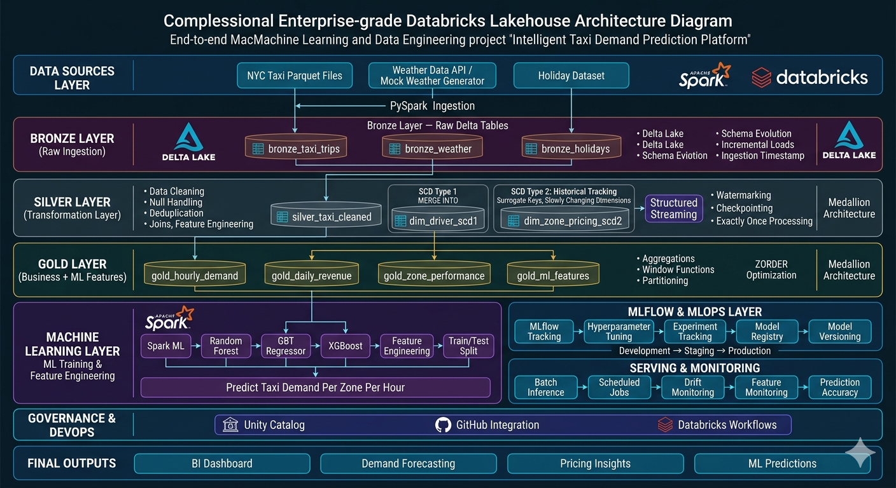

# databricks-taxi-demand-lakehouse

# 🚕 Databricks Taxi Demand Lakehouse Platform

An end-to-end Data Engineering and Machine Learning project built on the Databricks Lakehouse Platform using PySpark, Delta Lake, MLflow, and Medallion Architecture.

This project simulates a real-world production-grade analytics and ML pipeline for predicting taxi demand using NYC Taxi trip data enriched with weather and holiday datasets.

---

# 📌 Project Overview

The goal of this project is to build a scalable Lakehouse pipeline that covers:

* Data ingestion
* Bronze / Silver / Gold architecture
* Delta Lake transformations
* SCD Type 1 & Type 2 implementations
* Streaming concepts
* Feature engineering
* ML model training
* MLflow tracking & model registry
* Batch inference & monitoring

This project is designed for:

* Learning Data Engineering
* Learning Databricks ML workflows
* Databricks ML Professional Certification preparation
* Portfolio & resume building

---

# 🏗️ Architecture



---

# ⚙️ Tech Stack

| Technology           | Purpose                              |
| -------------------- | ------------------------------------ |
| Apache Spark         | Distributed Data Processing          |
| PySpark              | ETL & Transformations                |
| Delta Lake           | ACID Lakehouse Storage               |
| Databricks           | Unified Analytics Platform           |
| MLflow               | Experiment Tracking & Model Registry |
| Spark ML             | Machine Learning                     |
| Structured Streaming | Streaming Pipelines                  |
| GitHub               | Version Control                      |
| SQL                  | Data Analysis & Aggregations         |

---

# 📂 Project Structure

```bash
databricks-taxi-demand-lakehouse/

├── architecture/
├── data/
├── notebooks/
├── screenshots/
└── README.md
```

---

# 🥉 Bronze Layer

Raw ingestion layer storing source data with minimal transformations.


### Concepts Covered

* Parquet ingestion
* Delta tables
* Schema inference
* Ingestion timestamps
* Incremental loading

---

# 🥈 Silver Layer

Cleaned and transformed data layer.

### Concepts Covered

* Data cleaning
* Null handling
* Deduplication
* Data quality checks
* Joins & aggregations
* SCD Type 1
* SCD Type 2
* MERGE INTO operations


---

# 🥇 Gold Layer

Business-ready analytics and ML feature layer.

### Concepts Covered

* Window functions
* Aggregations
* Feature engineering
* Optimized analytical queries

---

# 🤖 Machine Learning Pipeline

The ML pipeline predicts taxi demand per zone per hour.

### Models Used

* Random Forest Regressor
* GBT Regressor
* XGBoost

### ML Concepts Covered

* Train/Test Split
* Feature Engineering
* Hyperparameter Tuning
* Model Evaluation
* Batch Inference

---

# 🔬 MLflow Integration

MLflow is used for:

* Experiment Tracking
* Parameter Logging
* Metric Logging
* Model Registry
* Model Versioning

---

# 🌊 Streaming Concepts

Structured Streaming concepts included:

* Watermarking
* Checkpointing
* Exactly-once processing
* Incremental streaming ingestion

---

# 📊 Key Features

* End-to-end Databricks Lakehouse implementation
* Delta Lake architecture
* SCD Type 1 & Type 2 pipelines
* Production-style ETL workflows
* MLflow integrated ML lifecycle
* Streaming + Batch processing
* Real-world feature engineering

---

# 📁 Dataset Sources

### NYC Taxi Dataset

NYC Taxi trip records dataset

### Weather Dataset

Mock/generated weather enrichment dataset

### Holiday Dataset

Custom holiday calendar dataset

---


# 📸 Screenshots

Screenshots available in the `/screenshots` folder.

Examples include:

* Bronze tables
* Delta history
* MLflow experiments
* Model registry
* Gold layer outputs

---

# 📚 Learning Outcomes

This project helped in understanding:

* Distributed data processing using Spark
* Delta Lake internals
* Medallion architecture
* Slowly Changing Dimensions
* Production ML workflows
* MLOps using MLflow
* Databricks ecosystem

---
# 👨‍💻 Author

Built as a hands-on Data Engineering + Machine Learning learning project using Databricks.

---
